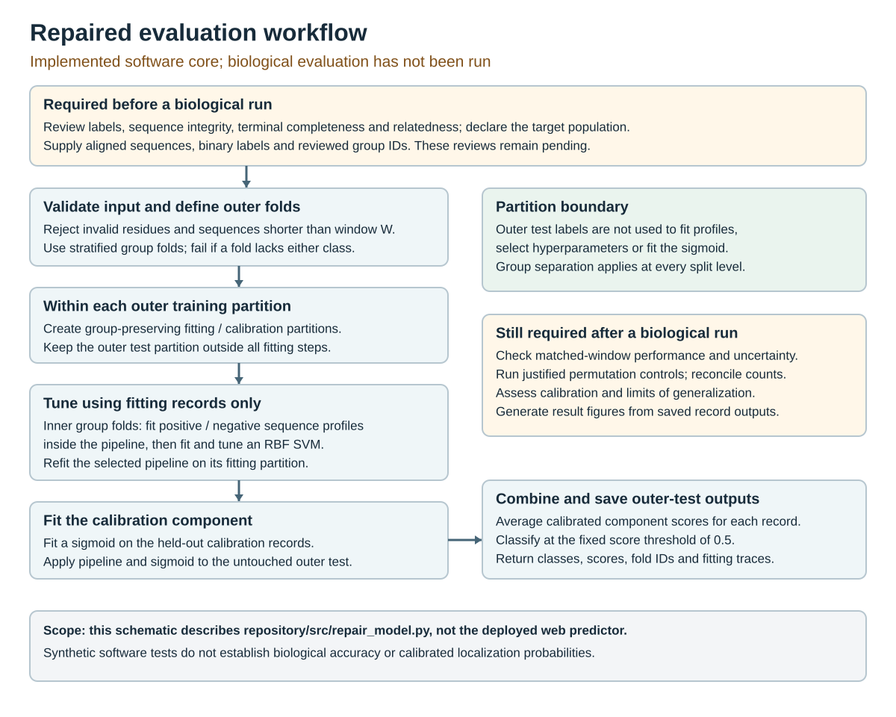

# PeroxisomeAI evaluation repair

Author: Ebenezer Kweku Ntiriakwa, Independent researcher.  
Contact: kntiriakwa@yahoo.com  
ORCID: https://orcid.org/0009-0008-7921-8200

**Status: tested software repair; biological evaluation not run.** This is not the deployed website, a trained model, or a complete reproducibility release for the manuscript. It must not be advertised as reproducing the original figures or performance.

## Implemented repair

`src/repair_model.py` contains a scikit-learn-compatible supervised encoder and a grouped nested evaluation core. Each calibration-training subset performs its own inner tuning with an encoder fitted inside the pipeline. Calibration outcomes and outer test outcomes never enter that tuning fit. All split indices and selected parameters are returned in a trace. Invalid protein characters, short sequences, unusable folds and incomplete predictions cause explicit errors.

The calibration ensemble changes the training procedure compared with the historical code. A new biological run is necessary; historical estimates cannot be relabelled as results from this repair. The grouping vector is an input, not a method of inferring families. Unique group labels do not solve relatedness in biological data.

## Software tests

Use Python 3.12 and the supplied versions in an isolated environment:

```powershell
python -m venv .venv
.venv\Scripts\python -m pip install -r requirements.txt
.venv\Scripts\python -m unittest discover -s tests -v
```

The session tests covered invalid residue rejection, training-only profile state, group separation, complete nested execution, split-index scope and deterministic repeated predictions. They used synthetic sequences only. Do not turn their values into manuscript findings. Exact environment details and the executed test log are in the accompanying audit directory.

## Before running on biological data

1. Freeze the PPero source release and input checksums; retain accession-level provenance and original labels.
2. Verify sequence integrity, terminal completeness, class evidence and eligibility for the PTS1 question. Record every exclusion with its reason.
3. Declare the generalization population. Establish a justified grouping rule, label–group balance and residual similarity across partitions. Do not weaken the target to obtain higher scores.
4. Freeze feasible split sizes, random seeds, paired comparison, uncertainty method, diagnostic permutations and descriptive strata before inspecting new results.
5. Call `nested_cv` with the same sequence ordering, labels, groups and seeds for both windows. Persist the returned trace, fold vector, probabilities and class predictions with stable IDs and checksums. The module does not yet provide a complete scientific run/provenance wrapper.
6. Complete grouped uncertainty, conditional prevalence and exploratory analyses. Preserve all results, not only favourable runs. Generate the entire manuscript and figure set from that frozen bundle.

Remaining analysis work includes the biological label/relatedness audit, dataset-specific run driver, formal permutation diagnostic, comparison/uncertainty reporting, figure generator and independent deployment assessment. The legacy aggregate report is not distributed here and must not be reused as output of this repaired code.

## Citation and rights

`CITATION.cff` contains the supplied author details and verified PPero attribution. The owned repository is https://github.com/Ebenkntiri/PeroxisomeAI. Add `version`, `date-released` and a version-specific `doi` only after an actual release. The MIT licence applies to original software. The PPero Apache licence is supplied for attribution preparation; this package does not bundle the upstream data or code. A manuscript/preprint licence is a separate author decision.

## Workflow illustration



This schematic documents implemented code structure. It is not a performance figure. Biological evaluation remains pending. The separately deployed exploratory website is https://v0-peroxisome-localization-predicto.vercel.app/; its source is not included in this repository.
